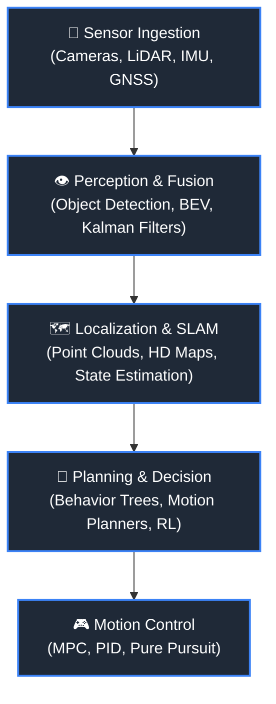

# 🏎️ NineGearsAI

**Pioneering Autonomous Mobility with Artificial Intelligence**

  A collaborative research and engineering group founded by students of the <b>Master in Artificial Intelligence Engineering (MEIA)</b> at <b>ISEP</b> (Instituto Superior de Engenharia do Porto).

---

## 📌 About Us

**NineGearsAI** is an AI-driven engineering initiative tackling the challenges of modern self-driving and automated vehicle systems. 

As graduate students at **ISEP**, our goal is to bridge the gap between theoretical AI models and real-world embedded robotics, building robust, safe, and intelligent algorithms capable of autonomous perception, decision-making, and control.

---

## 🎯 Core Research & Development Pillars

We structure our work around the complete autonomous driving software stack:

- 👁️ **Perception & Sensor Fusion:** Multi-camera object detection, 3D LiDAR point cloud processing, and multi-object tracking.
- 🗺️ **Localization & Mapping (SLAM):** High-definition mapping and robust state estimation in dynamic environments.
- 🧠 **Behavioral Decision & Motion Planning:** Deep Reinforcement Learning (DRL), path planning (`A*`, `Hybrid A*`), and trajectory optimization.
- 🎮 **Simulation & Testing:** End-to-end evaluation using simulated testbeds like **CARLA** and **Gazebo**.

---

## 🛠️ Tech Stack & Tooling

| Domain | Technologies & Frameworks |
| :--- | :--- |
| **Languages** | `Python`, `C++`, `CUDA` |
| **AI / ML** | `PyTorch`, `TensorFlow`, `scikit-learn`, `OpenCV` |
| **Robotics & Middleware** | `ROS 2 (Humble / Iron)`, `Micro-ROS` |
| **Simulation** | `CARLA Simulator`, `Gazebo`, `AirSim` |
| **DevOps & Tools** | `Git`, `Docker`, `Linux (Ubuntu)`, `Weights & Biases` |

---

## 🚀 Active Repositories & Projects
- **[INVINIA](https://github.com/NineGears-AI/invinia)** — Investigação e Inovação em Inteligência Artificial.
- **[AEPSOEIA](https://github.com/NineGears-AI/aspsoeia)** - Aspetos Sociais e Éticos em Inteligência Artificial
---

## 👥 The Team

We are a group of passionate MEIA students from the **Instituto Superior de Engenharia do Porto (ISEP)**:

---

## 📬 Contact & Connect

- 🏫 **Institution:** [ISEP - Instituto Superior de Engenharia do Porto](https://www.isep.ipp.pt)
- 🎓 **Degree:** [Mestrado em Engenharia de Inteligência Artificial (MEIA)](https://www.isep.ipp.pt/Course/Course/468)

  Built with passion and gear shifts by <b>NineGearsAI</b> ⚙️

